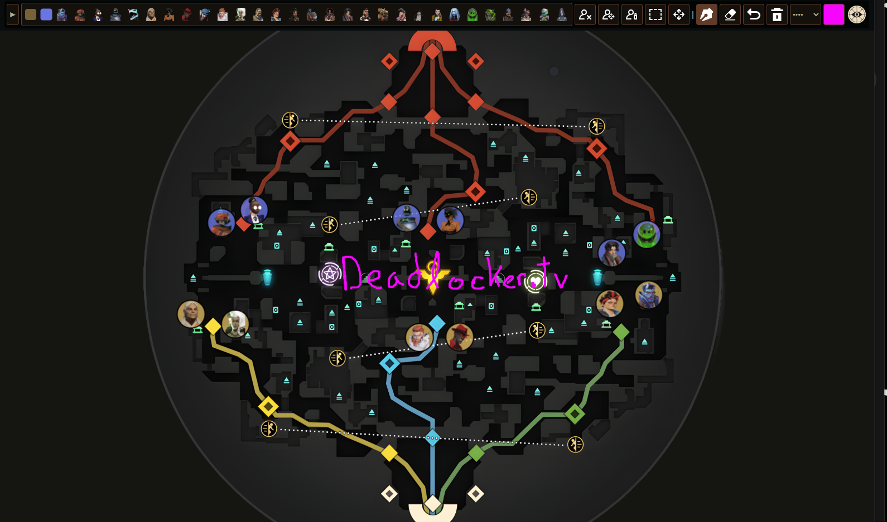

# [Deadlocker.tv](https://deadlocker.tv)
A community website linking to and hosting deadlock web apps and tools. Featuring a twitch stream embedded into the homepage. Hosted at [deadlocker.tv](https://deadlocker.tv)

## Tools

### [Tactical Map](https://deadlocker.tv/map)



A map for competitive teams to draw up strategies on. Useful for players, coaches, analysts and broadcasters.

Features:
- [x] All new heroes icons
- [x] Draw Function, different colours, thickness
- [x] Eraser/Clear
- [x] Hero icons that can be moved around, amber/sapphire
- [x] Undo
- [x] Keybinds for buttons
- [x] Icon drag and drop in
- [x] Multi icon move
- [ ] Text tool
- [ ] Redo
- [ ] Lines?
- [ ] SVG Layers, base map, camps, objectives, names of areas
- [ ] Save map and reload
- [ ] Private rooms where teams can draw together

### [Farm Graph](https://deadlocker.tv/farm)
A chart mapping soul values for each entity given a point in time. Useful for determining which resources are most efficient to farm.

### Commands
A bunch of useful commands to use in the dev console.

<!---
### Camps
Explain what the names of the camps are
--->

### iframe

You can embed the hosted apps directly into your website with an iframe.

```html
<iframe 
    src="https://deadlocker.tv/map"
    width="600" 
    height="600" 
    frameborder="2" 
    allowfullscreen 
    title="Embedded Content">
</iframe>
```

## Technical

### Dependencies

```
go install github.com/a-h/templ/cmd/templ@v0.2.778
go get github.com/a-h/templ
templ generate
go mod tidy
```
